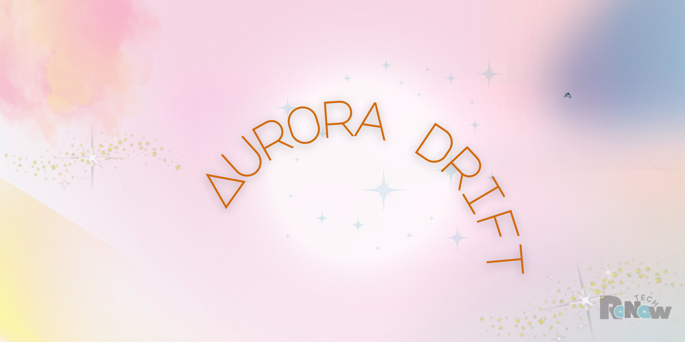

<!-- Aurora Drift: Animated Sparkle Gradient Background Template -->
<!DOCTYPE html>
<html lang="en">
<head>
  <meta charset="UTF-8" />
  <meta name="viewport" content="width=device-width, initial-scale=1.0" />
  <meta name="description" content="Aurora Drift: A lightweight animated HTML5 background template with shimmer, gradient motion, and sparkle drift." />
  <title>Aurora Drift Template</title>
  <link rel="stylesheet" href="styles.css" />
  <link rel="icon" type="image/x-icon" href="favicon.ico" />
</head>
<body>
  <canvas id="sparkle-canvas"></canvas>
  <main class="content">
    <h1>Aurora Drift</h1>
    <p>Lightweight animated gradient & particle shimmer for elegant web pages.</p>
    <a class="cta-btn" href="#">Explore Template</a>
  </main>
  <script src="sparkle.js"></script>
</body>
</html>

<!-- ================== README.md ================== -->
<!--
# ✨ Aurora Drift

> A lightweight animated background template with flowing gradients and gentle sparkle drift — perfect for modern, elegant websites.



---

## 🌟 Features

- 🎨 **Aesthetic Gradient Animation**  
  Soft, flowing background powered by CSS keyframes.

- ✨ **Custom Sparkle Drift Effect**  
  Lightweight JS-based canvas particles that float gently across the screen.

- 💻 **Responsive Design**  
  Optimized for mobile, tablets, and desktops.

- 🌙 **Minimal Setup**  
  Just HTML, CSS, and JS — no frameworks or build tools required.

---

## 📁 File Structure

```
aurora-drift-template/
├── index.html
├── styles.css
├── sparkle.js
├── favicon.ico
├── LICENSE.txt
├── README.md
└── screenshots/
    └── aurora-drift-preview.png
```

---

## 🚀 Quick Start

1. Clone the repo:
   ```bash
   git clone https://github.com/ReNewTechSolutions/aurora-drift-template
   ```
2. Open `index.html` in your browser.

🎉 No dependencies. No build tools. Just open and go.

---

## 🔧 Customization Ideas

| Element           | How to Change                          |
|-------------------|----------------------------------------|
| Colors            | Edit in `styles.css` `:root` variables |
| Sparkle Count     | Adjust `particleCount` in `sparkle.js` |
| Fonts             | Modify `font-family` in `styles.css`   |
| Opacity / Intensity | Tweak CSS opacity or particle radius |

---

## 📸 Social Preview

Be sure to upload your `screenshots/aurora-drift-preview.png` in:

**Repo → Settings → Social preview**

---

## 🧠 Use Cases

- Personal portfolios  
- Hero sections  
- Product landing pages  
- Aesthetic micro-sites  
- Promo banners

---

## 📜 License

This template is licensed to **ReNewTech Solutions © 2025**  
Use is permitted for demo, educational, and client projects.  
Redistribution or reselling without permission is prohibited.

---

## 👋 Author

Built with 💚 by [ReNewTech Solutions](https://renewt3ch.com)  
Got questions? Reach out via **info@renewt3ch.com**
-->
